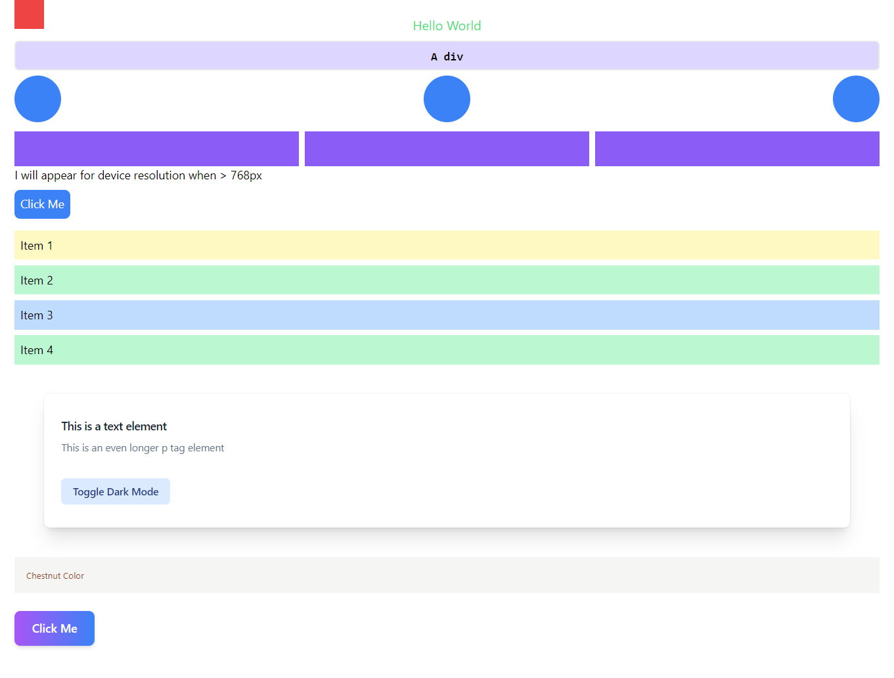

# Tailwindcss Basics

contains many concepts of tailwindcss including advanced features and how to use them.

## Technologies

html, tailwindcss

## Getting Started

### Pre-requisites

Node.js, NPM, code editor like VSCode.

### Install project dependencies/devDependencies

```bash
npm install
```

### Run project

Run this command in terminal, if you want to make changes in file.

```bash
npm run watch
```

Open `./src/index.html` file with your browser to see the result.

## Screenshots


